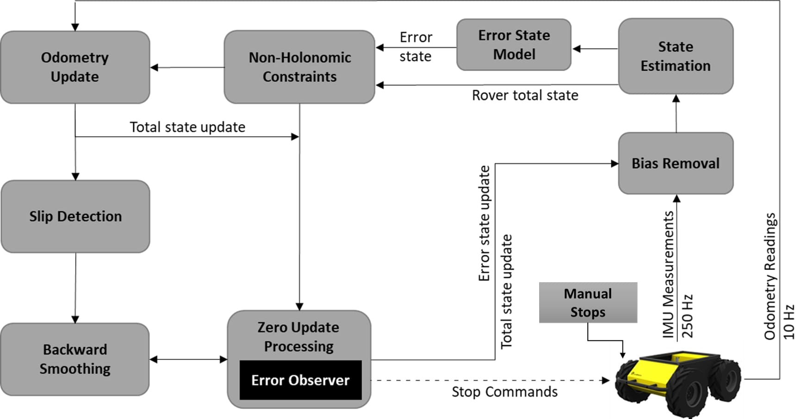
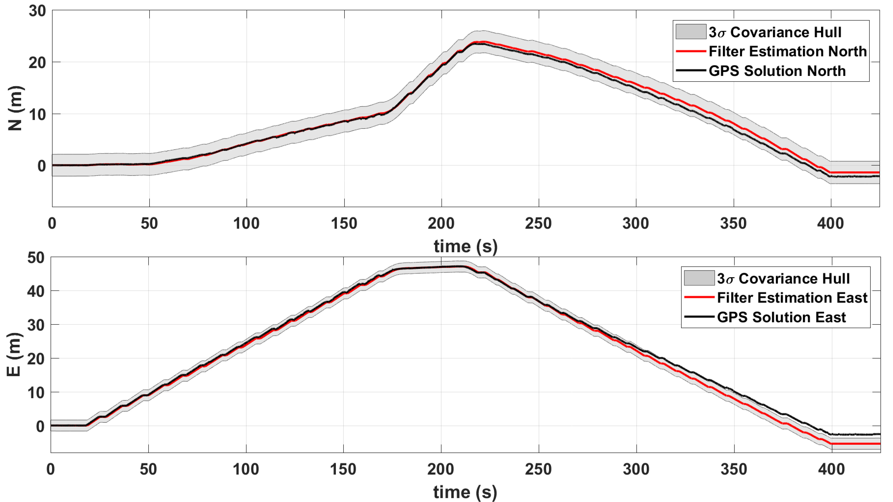

# Core Navigation (CN)

## Overview
Improved Planetary Rover Inertial Navigation and Wheel Odometry Performance through Periodic Use of Zero-Type Constraint

**Keywords:** navigation, dead-reckoning, zero-velocity, non-holonomic

**Author: Cagri Kilic 
Affiliation: [WVU NAVLAB](https://navigationlab.wvu.edu/) 
Maintainer: Cagri Kilic, cakilic@mix.wvu.edu**

Images of the core navigation software in use:

### Publications

If you use this work in an academic context, please cite the following publication:

* Cagri Kilic, Jason N. Gross, Nicholas Ohi, Ryan Watson, Jared Strader, Thomas Swiger, Scott Harper, and Yu Gu: **Improved Planetary Rover Inertial Navigation and Wheel Odometry Performance through Periodic Use of Zero-Type Constraints**.

## IROS Review

To generate the same figures in the paper, use [v.1.0](https://github.com/wvu-navLab/CLN/tree/v1.0) and simply run MainRun.m
